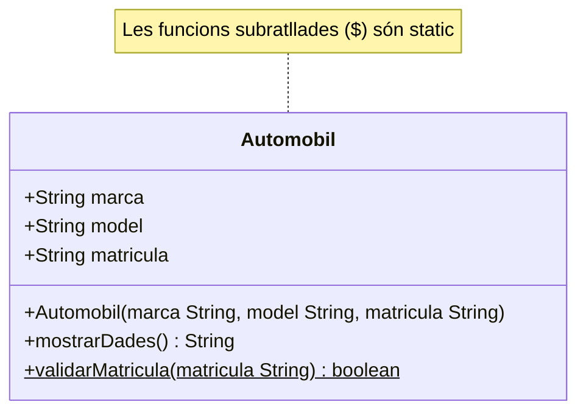
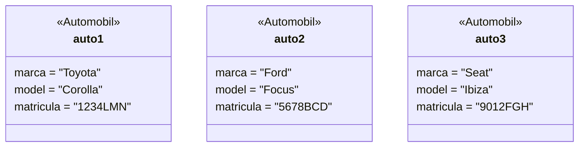

# Diagrama UML - Classe Automobil
# LlogaAuto S.L. - Mòdul 5 A5.1

---

## Diagrama d'objectes (3 instàncies)

---

## Explicació del format de matrícula espanyola

| Posició | 1   | 2   | 3   | 4   | 5   | 6   | 7   |
|---------|-----|-----|-----|-----|-----|-----|-----|
| Tipus   | Nº  | Nº  | Nº  | Nº  | Ll. | Ll. | Ll. |
| Exemple | 1   | 2   | 3   | 4   | L   | M   | N   |

- **4 primers**: dígits numèrics (0-9)
- **3 últims**: consonants (sense A, E, I, O, U, Ñ, Q)
