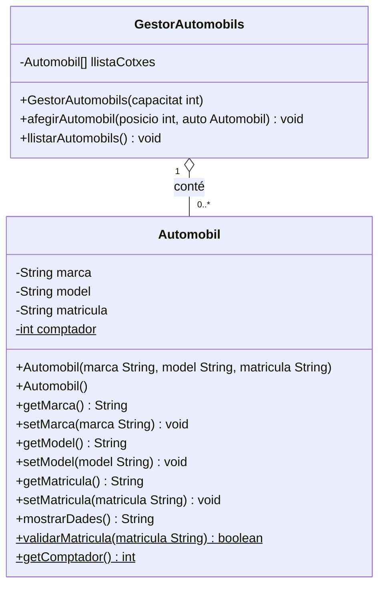
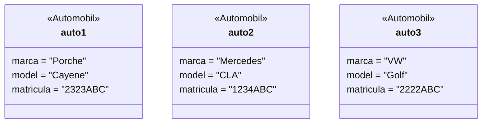

# Diagrama UML - A5.2 Diagrames de classes
# LlogaAuto S.L.

## Diagrama de classes complet (Mermaid)



> `$` indica mètode/atribut **static** (subratllat en UML clàssic)

---

## Diagrama d'objectes - Instàncies del punt 3



---

## Comandes Git de l'activitat

```bash
# 1. Clonar el projecte del professor
git clone https://github.com/jraichs01/app-llogauto.git

# 2. Afegir el teu repositori remot
git remote add origin <url del teu repositori>

# 3. Comprovar la branca principal
git branch

# 4. Crear i canviar a la nova branca
git branch activitat_5_2
git switch activitat_5_2

# 5. Fer els canvis... (modificar Automobil.java, crear GestorAutomobils.java i Main.java)

# 6. Commit dels canvis
git add .
git commit -m "feat: A5.2 - atributs privats, getters/setters, GestorAutomobils i menu"

# 7. Pujar la branca
git push origin activitat_5_2

# 8. Unir amb main (merge)
git switch main
git merge activitat_5_2
git push origin main
```
