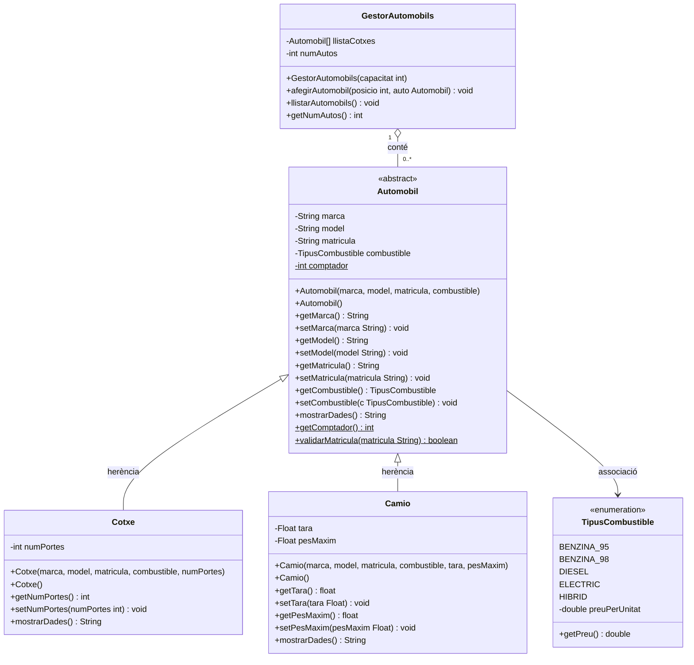

# Diagrama UML - A5.3 Herència
# LlogaAuto S.L.

## Diagrama complet (Mermaid)



---

## Comandes Git - A5.3

```bash
# Partir de la branca activitat_5_2
git switch activitat_5_2

# Crear i canviar a la nova branca
git branch activitat_5_3
git switch activitat_5_3

# Fer els canvis (nous fitxers: TipusCombustible, Cotxe, Camio)
# Modificar: Automobil (abstract), GestorAutomobils, Main

git add .
git commit -m "feat: A5.3 - herencia Cotxe i Camio, abstract Automobil, enum TipusCombustible"
git push origin activitat_5_3

# Merge a main
git switch main
git merge activitat_5_3
git push origin main
```
